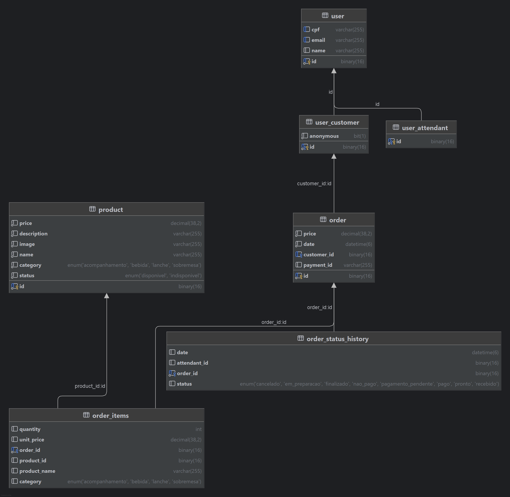

# MySQL Terraform Infrastructure

Este repositório contém a infraestrutura como código (IaC) para provisionar uma base de dados MySQL na AWS usando Terraform. O projeto faz parte do TechChallenge da FIAP e está preparado para integração com clusters EKS.

## 📋 Visão Geral

O projeto provisiona:

- **VPC** com subnets públicas e privadas
- **Banco de dados MySQL** (RDS) na versão 8.0
- **Security Groups** configurados para acesso seguro
- **Subnet Groups** para isolamento do banco de dados

## 🏗️ Modelagem de dados


**Banco escolhido:** Amazon RDS (Mysql)

Optamos pelo Amazon RDS com MySQL porque ele oferece uma solução gerenciada que garante alta disponibilidade, escalabilidade e segurança. Considerando as características da aplicação que estamos desenvolvendo, a escolha de um banco de dados relacional e que a equipe possui um domínio é a mais adequada, pois ele é ideal para lidar com dados estruturados, garantindo consistência e integridade.

Com o MySQL, temos a capacidade de executar consultas complexas e gerar relatórios e análises no futuro, conforme a necessidade da aplicação.

Essa escolha nos proporciona o equilíbrio ideal entre performance, segurança e facilidade de gerenciamento, permitindo que o sistema cresça de forma sustentável sem comprometer a qualidade e a integridade dos dados.

## 🚀 Recursos Provisionados

### Base de Dados MySQL

- **Engine**: MySQL 8.0
- **Storage**: 20 GB (auto-scaling até 50 GB)
- **Database Name**: `fiap`
- **Backup**: Retenção de 3 dias
- **Multi-AZ**: Não

### VPC e Networking

- **CIDR**: 10.0.0.0/16
- **Availability Zones**: 2 AZs
- **Public Subnets**: 10.0.101.0/24, 10.0.102.0/24
- **Private Subnets**: 10.0.1.0/24, 10.0.2.0/24
- **NAT Gateway**: Single NAT Gateway

## 📦 Pré-requisitos

- [Terraform](https://www.terraform.io/downloads.html) >= 1.0
- [AWS CLI](https://aws.amazon.com/cli/) configurado
- Conta AWS com permissões adequadas

## ⚙️ Configuração

### 1. Clone o repositório

```bash
git clone <repository-url>
cd mysql-terraform
```

### 2. Configure as variáveis

Edite o arquivo `terraform.tfvars`:

```hcl
aws_region            = "us-east-1"
db_password           = "sua_senha_segura"
eks_security_group_id = "sg-xxxxxxxxx"
```

### 3. Configure o backend S3 (Opcional)

Se necessário, atualize as configurações do backend S3 no arquivo `main.tf` para funcionamento do Terraform States em Cloud:

```hcl
backend "s3" {
  bucket = "seu-bucket-terraform"
  key    = "rds/terraform.tfstate"
  region = "us-east-1"
}
```

## 🚀 Deploy

### Inicializar Terraform

```bash
terraform init
```

### Planejar a infraestrutura

```bash
terraform plan
```

### Aplicar as mudanças

```bash
terraform apply
```

### Confirmar o deploy

Digite `yes` quando solicitado para confirmar a criação dos recursos.

## 📊 Outputs

Após o deploy bem-sucedido, os seguintes outputs estarão disponíveis:

| Output                  | Descrição                          |
| ----------------------- | ---------------------------------- |
| `rds_endpoint`          | Endpoint de conexão do banco MySQL |
| `rds_connection_string` | String de conexão JDBC completa    |
| `rds_security_group_id` | ID do Security Group do RDS        |
| `vpc_id`                | ID da VPC criada                   |
| `private_subnet_ids`    | IDs das subnets privadas           |
| `public_subnet_ids`     | IDs das subnets públicas           |

### Exemplo de uso dos outputs:

```bash
# Obter endpoint do banco
terraform output rds_endpoint

# Obter string de conexão JDBC
terraform output rds_connection_string
```

## 🔒 Segurança

### Security Groups

- O banco de dados está isolado em subnets privadas
- Acesso MySQL (porta 3306) controlado via Security Group
- Sem acesso público direto ao banco

### Credenciais

- Senha do banco definida como variável sensível
- Recomenda-se usar AWS Secrets Manager para produção

## 🧹 Limpeza

Para destruir todos os recursos criados:

```bash
terraform destroy
```

**⚠️ Atenção**: Esta operação é irreversível e irá deletar todos os dados do banco!

## 📁 Estrutura do Projeto

```
mysql-terraform/
├── main.tf           # Configuração principal e providers
├── rds.tf           # Recursos do banco MySQL
├── vpc.tf           # Configuração da VPC
├── variables.tf     # Definição de variáveis
├── outputs.tf       # Outputs do Terraform
├── terraform.tfvars # Valores das variáveis
└── README.md        # Esta documentação
```

## 🤝 Integração com EKS

Este projeto está preparado para integração com clusters EKS:

1. Configure a variável `eks_security_group_id` com o ID do Security Group do EKS
2. O Security Group do RDS será configurado automaticamente para aceitar conexões do EKS

## 🏷️ Tags

Todos os recursos são tagueados com:

- `Terraform = "true"`
- `Project = "techchallenge"`

---

**Desenvolvido para o TechChallenge FIAP** 🚀
